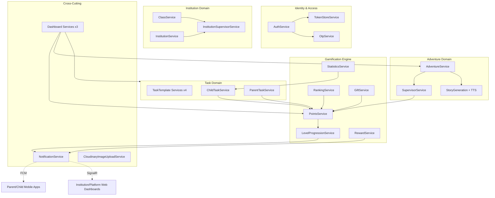
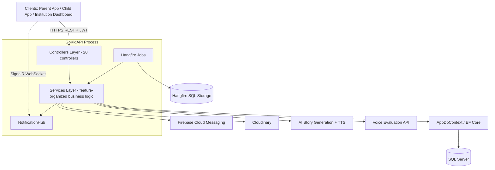
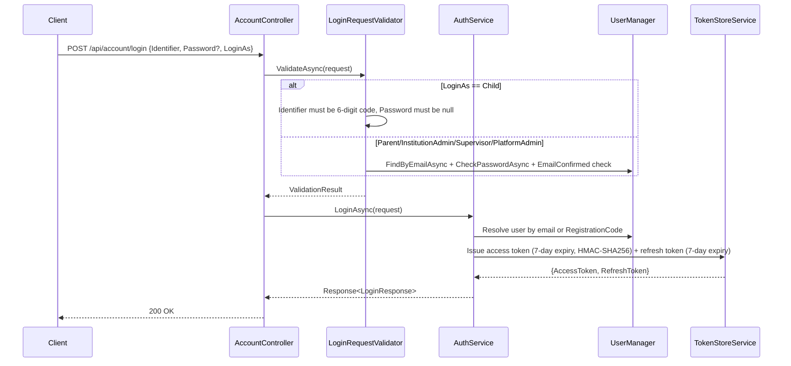
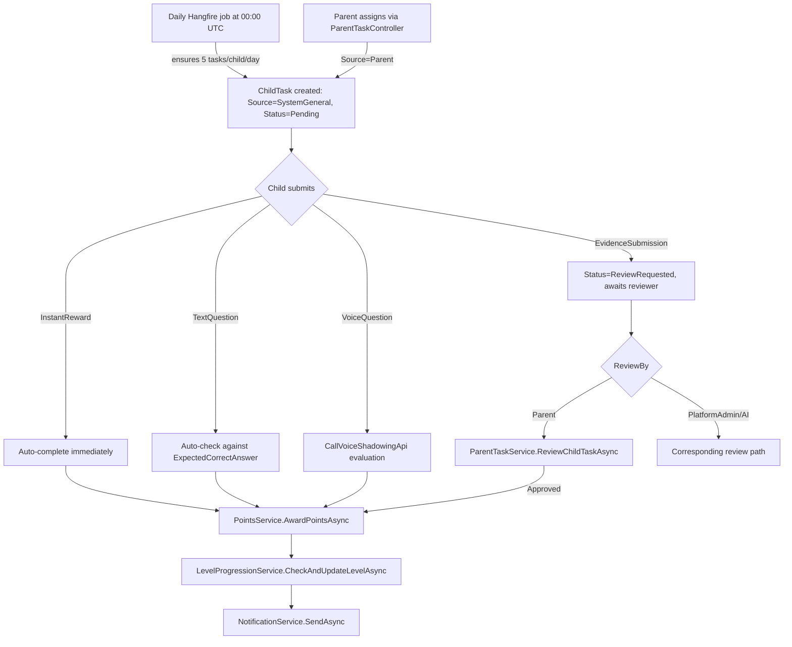
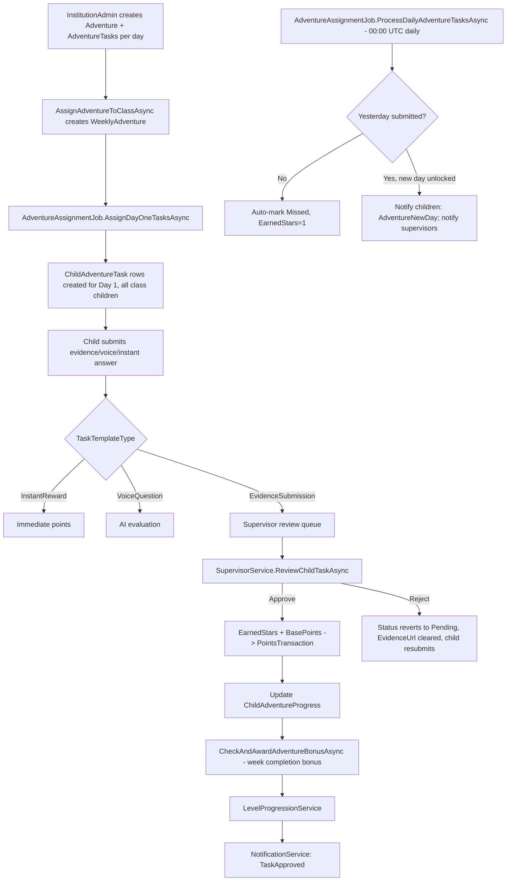
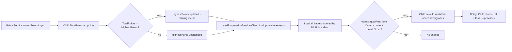
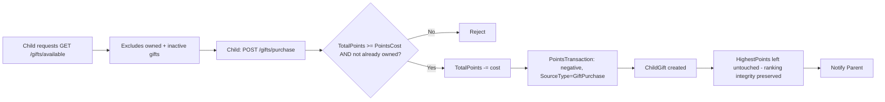

# GoKidAPI — Project Analysis

**Internal engineering knowledge base. Single source of truth for all downstream graduation documentation.**

This document is a reverse-engineered account of the GoKidAPI backend, produced by direct static analysis of the source code at `f:\GoKid\GoKidAPI\GoKidAPI` (ASP.NET Core 8, EF Core, SQL Server). Every claim below is traceable to a specific file, class, or configuration key. Where the codebase does not answer a question, this is stated explicitly rather than filled in with assumption.

**Repository scope confirmed:** `f:\GoKid` contains only `GoKidAPI` (this backend project), `.git`, and `.vs` (IDE cache). **No mobile application codebase (Flutter/React Native/MAUI/Xamarin) exists in this repository.** Every section below that would normally describe a mobile client (navigation, state management, reusable UI components, design system) is therefore marked **N/A — not present in this repository** rather than invented. If mobile-app documentation is required, it must be produced from the separate mobile repository, which is not available for this analysis.

---

## Table of Contents

1. [Project Purpose](#1-project-purpose)
2. [Business Domain & Core Problems](#2-business-domain--core-problems)
3. [System Goals](#3-system-goals)
4. [Target Users & Roles](#4-target-users--roles)
5. [Complete Feature List](#5-complete-feature-list)
6. [Application Modules Overview](#6-application-modules-overview)
7. [Backend Architecture](#7-backend-architecture)
8. [Mobile Architecture](#8-mobile-architecture)
9. [Folder Structure & Project Organization](#9-folder-structure--project-organization)
10. [Authentication & Authorization](#10-authentication--authorization)
11. [Database Structure & Entity Relationships](#11-database-structure--entity-relationships)
12. [Core Business Workflows](#12-core-business-workflows)
13. [API Architecture](#13-api-architecture)
14. [Notification Architecture (SignalR + Firebase)](#14-notification-architecture-signalr--firebase)
15. [Background Jobs & Scheduled Jobs (Hangfire)](#15-background-jobs--scheduled-jobs-hangfire)
16. [File Storage (Cloudinary)](#16-file-storage-cloudinary)
17. [Level System](#17-level-system)
18. [Reward System](#18-reward-system)
19. [Adventure System](#19-adventure-system)
20. [Task System](#20-task-system)
21. [Ranking System](#21-ranking-system)
22. [Statistics System](#22-statistics-system)
23. [Gift System](#23-gift-system)
24. [Institution Management](#24-institution-management)
25. [Supervisor Management](#25-supervisor-management)
26. [Role Workflows (Parent / Child / InstitutionAdmin / Supervisor / PlatformAdmin)](#26-role-workflows)
27. [Dashboard Architecture](#27-dashboard-architecture)
28. [Mobile Navigation, State Management, UI/Design System](#28-mobile-navigation-state-management-uidesign-system)
29. [Error Handling & Validation Strategy](#29-error-handling--validation-strategy)
30. [Security Mechanisms](#30-security-mechanisms)
31. [Performance & Caching Strategy](#31-performance--caching-strategy)
32. [Logging Strategy](#32-logging-strategy)
33. [Design & Architectural Patterns](#33-design--architectural-patterns)
34. [Scalability Considerations](#34-scalability-considerations)
35. [Third-Party Integrations](#35-third-party-integrations)
36. [Deployment Assumptions](#36-deployment-assumptions)
37. [Known Issues / Technical Debt Register](#37-known-issues--technical-debt-register)
38. [Appendix — Full Reference Tables](#38-appendix--full-reference-tables)

---

## 1. Project Purpose

GoKidAPI is the backend of **GoKid**, a gamified child-development platform. It converts two categories of real-world child activity — informal, parent-assigned responsibilities, and formal, institution-issued multi-day "Adventures" — into a single, auditable points-and-levels economy, with redeemable in-platform gifts and parent-defined custom rewards. The API is the sole authority for identity, task lifecycle, gamification state, and cross-role notification for three client surfaces: a parent mobile app, a child mobile app, and institution-facing web dashboards (none of which exist in this repository — see [§8](#8-mobile-architecture)).

## 2. Business Domain & Core Problems

| Problem | Manifestation in the codebase |
|---|---|
| Parents lack a structured, rewarding way to assign and verify everyday responsibilities | `ChildTask` entity + `ParentTaskService` (assign/review flow), `TaskSource.Parent` |
| Institutions need to extend structured, curriculum-like activity beyond the classroom with supervisor oversight | `Adventure`/`WeeklyAdventure`/`ChildAdventureTask` graph + `SupervisorService.ReviewChildTaskAsync` |
| Gamified systems commonly lack a real, tamper-evident economy | `PointsTransaction` ledger (signed integers, `SourceType` enum), spend-independent `Child.HighestPoints` |
| Multiple concurrent client types (2 mobile apps + institutional web dashboards) need role-appropriate real-time updates | Dual-channel `NotificationService`: Firebase push vs. SignalR |
| A child cannot manage a password like an adult | Password-less login via a 6-digit `RegistrationCode` + QR code, distinct from the email/password flow used by all other roles |

## 3. System Goals

1. One unified identity substrate (`AppUser`) serving five distinct actor types with different authentication mechanics.
2. Two independently-reviewable task tracks (general/parent vs. institutional/Adventure) that converge on one gamification engine.
3. A verifiable points ledger driving level progression that never regresses, and a ranking metric (`HighestPoints`) immune to spending.
4. Institution-scale administration: multi-institution, multi-class, multi-supervisor management from one platform-admin vantage point.
5. Near-real-time cross-role visibility into task submissions, approvals, level-ups, and administrative events.
6. Automated day-to-day operational mechanics (daily task refresh, Adventure day unlocking/auto-miss) without manual admin intervention, via scheduled background jobs.

## 4. Target Users & Roles

The system recognizes exactly **five** actor types, stored as a single `UserType` enum on `AppUser` and mirrored 1:1 by five ASP.NET Identity roles (seeded in `Seeder/RoleSeeder.cs`):

| UserType (enum value) | Identity Role | Profile Entity | Primary Surface (inferred, not in this repo) |
|---|---|---|---|
| 0 — Parent | `Parent` | `Parent` (shared PK with `AppUser`) | Parent mobile app |
| 1 — Child | `Child` | `Child` (shared PK with `AppUser`) | Child mobile app |
| 2 — InstitutionAdmin | `InstitutionAdmin` | `InstitutionAdmin` (shared PK) | Institution web dashboard |
| 3 — Supervisor | `Supervisor` | `Supervisor` (own PK + `AppUserId` FK) | Institution web dashboard |
| 4 — PlatformAdmin | `PlatformAdmin` | *(none — pure `AppUser` + role)* | Platform admin web dashboard |

## 5. Complete Feature List

Grouped by domain, each item traceable to a controller/service pair documented in later sections.

- **Identity:** parent self-registration + OTP email verification; child creation by parent (registration code + QR); password/email change (OTP and link-based); JWT access + refresh-token rotation; role-branching login.
- **Institution operations:** institution CRUD + auto-provisioned admin account; class CRUD; supervisor provisioning + class assignment; child enrollment into institution/class via registration code.
- **Task system (general track):** 4 task-template types (Instant Reward, Text Question, Voice Question, Evidence Submission); daily auto-assignment (5/day/child); parent assignment/review; self/parent/AI grading depending on type.
- **Adventure system (institutional track):** bilingual, multi-day adventure templates with AI-generated story text and TTS narration; weekly assignment to a class; per-day task unlock; supervisor evidence review; automatic day advancement and miss-marking.
- **Gamification:** points ledger; non-regressive level progression (15 levels); platform gift catalog + purchase; parent-defined custom rewards; global and institution-scoped leaderboards; personal statistics (weekly/monthly/all-time + week-over-week trend).
- **Notifications:** 20 notification types; persisted history; push (Firebase) for mobile roles; real-time (SignalR) for web-dashboard roles; unread count and mark-as-read endpoints.
- **Dashboards:** three cached, role-scoped analytics dashboards (Platform, Institution, Supervisor).
- **Operational automation:** daily task assignment job, daily adventure-day processing job, on-demand TTS generation jobs.

## 6. Application Modules Overview



Module coupling is intentionally centralized through `PointsService.AwardPointsAsync` — it is the single choke point every reward-producing workflow (`ChildTaskService`, `ParentTaskService`, `SupervisorService`, gift purchase reversal) passes through, ensuring one consistent ledger and one consistent level-progression trigger.

## 7. Backend Architecture

Layered (N-tier) monolithic ASP.NET Core 8 Web API — a single deployable process, not a microservices topology.



**Layers:**

| Layer | Location | Responsibility |
|---|---|---|
| Presentation | `Controllers/` | HTTP binding, `[Authorize]` enforcement, manual FluentValidation invocation, `Response<T>` shaping |
| Business logic | `Services/` (one folder per feature) | All domain rules — auth, points, levels, tasks, adventures, dashboards, notifications |
| Data access | `Data/AppDbContext.cs` | EF Core model, soft-delete filters, enum-as-string conversion, relationship/delete-behavior configuration |
| Background processing | `Jobs/` (Hangfire) | Daily task/adventure automation, on-demand TTS generation |
| Real-time transport | `Hubs/NotificationHub.cs` | SignalR group-based push to web-dashboard clients |
| Cross-cutting | `Extensions/`, `Shared/`, `Helpers/`, `Validators/`, `Seeder/` | DI composition, response envelope, pagination, validation, startup data seeding |

No Repository/Unit-of-Work abstraction exists — services inject `AppDbContext` directly (see [§33](#33-design--architectural-patterns)).

## 8. Mobile Architecture

**N/A — not present in this repository.** No mobile codebase (Flutter, React Native, .NET MAUI, Xamarin, or native Android/iOS) exists under `f:\GoKid`. Any documentation of mobile architecture, navigation, or UI must be sourced from a separate repository not available to this analysis. The backend's mobile-facing contract is inferable only from: JWT bearer auth, multipart/form-data endpoints for media upload, Firebase Cloud Messaging push delivery, and the child's password-less registration-code/QR login flow.

## 9. Folder Structure & Project Organization

```
GoKidAPI/
├── Controllers/          20 REST controllers, one per feature area
├── Entity/                EF Core domain classes
│   ├── Account/
│   │   ├── Identity/       AppUser, AppRole
│   │   ├── Users/          Parent, Child, Supervisor
│   │   └── UserTokens/     UserRefreshToken
│   ├── Base/               AuditableEntity
│   ├── Classes/             Class, ClassSupervisor
│   ├── Gifts/               Gift, ChildGift, Reward
│   ├── Institiution/        Institution, InstitutionAdmin, Adventure, AdventureTask,
│   │                        WeeklyAdventure, ChildAdventureProgress, ChildAdventureTask
│   │                        (folder name is a source-level typo, kept as-is)
│   ├── Levels/               Level
│   ├── Tasks/                TaskCategory, TaskSubCategory, TaskTemplateBase, ChildTask
│   ├── Notification.cs, PointsTransaction.cs   (loose files)
├── Data/                  AppDbContext, KeyApiAuthorizationDbContext (Duende IdentityServer base)
├── DTO/                   Request/Response DTOs, one subfolder per feature, split Requests/Responses
├── Migrations/            5 EF Core migrations + model snapshot
├── Enums/                 Adventures/, Gifts/, Shared/, Tasks/ + top-level shared enums
├── Services/              One folder per feature, I*Service + implementation
├── Jobs/                  Hangfire job classes
├── Hubs/                  NotificationHub (SignalR)
├── Seeder/                RoleSeeder, UserSeeder, CategoriesSeeder, LevelSeeder
├── Helpers/, Shared/      ResponseHandler, Response<T>, PaginatedList<T>, RequestFilters<T>, IWWHelper
├── Extensions/            ServiceCollectionExtensions.cs (all DI/composition wiring)
├── InfrastructreManage/Options/   Strongly-typed options (JwtOptions, CloudinaryOptions, EmailOptions, RedirectLinksSettings)
├── Validators/            FluentValidation validators (Auth, Category, Tasks, RequestFilters)
├── wwwroot/EmailTemplates/ HTML email templates
├── Logs/                  Serilog file sink output (unbounded growth — no retention configured)
├── Program.cs             Startup composition + middleware pipeline + seeding + Hangfire recurring job registration
├── appsettings.json       All configuration, including plaintext secrets (see §37)
└── GoKidAPI.csproj        Package references (see §38)
```

The `Docs/` folder (containing this file and the graduation-documentation chapters produced earlier) is a documentation-only addition, not part of the application runtime.

## 10. Authentication & Authorization

### 10.1 Identity Model

All five actor types share the single ASP.NET Identity table `AspNetUsers` (`AppUser : IdentityUser`), differentiated by `UserType` and an Identity role. Domain profile data is attached via a satellite-table pattern:

| Actor | Key relationship to `AppUser` |
|---|---|
| Parent | Shared primary key, cascade delete |
| Child | Shared primary key, cascade delete |
| InstitutionAdmin | Shared primary key, cascade delete (corrected in migration 4 — previously a separate FK column) |
| Supervisor | **Independent** primary key + `AppUserId` FK (not shared-PK, unlike the other three) |
| PlatformAdmin | No satellite table at all — pure `AppUser` + role |

### 10.2 Login Flow



- **Access token claims:** `NameIdentifier`, `GivenName`, `Email`, one `Role` claim per assigned role.
- **Refresh token:** random 32-byte value, persisted in `UserRefreshTokens`, `IsUsed` flag + `ExpiryDateUtc`; `InvalidateOldTokensAsync` clears all of a user's prior refresh tokens on rotation.
- **Token transport inconsistency (flagged):** the JWT bearer handler's `OnMessageReceived` reads the token from a cookie named `.AspNetCore.Identity.Application` — an unusual choice for a bearer-token API — while Swagger's configured security scheme assumes the standard `Authorization: Bearer` header. Both paths can coexist, but the cookie-read logic unconditionally sets `context.Token` (even to `null` if the cookie is absent), which risks interfering with standard header-based token extraction. This is noted as a design inconsistency, not a confirmed runtime failure.

### 10.3 Authorization Enforcement

Authorization is inconsistently applied across controllers — a mix of declarative `[Authorize(Roles=...)]` attributes and manual claim-based checks inside services:

| Enforcement style | Controllers |
|---|---|
| Class-level `[Authorize(Roles=...)]` | `GiftsController` (per-action roles), `InstitutionsController` (PlatformAdmin), `InstitutionDashboardController` (InstitutionAdmin), `PlatformDashboardController` (PlatformAdmin), `SupervisorController`/`SupervisorDashboardController` (Supervisor), `LevelsController` (PlatformAdmin), `RankingController`/`StatisticsController` (Child,Parent) |
| `[Authorize]` only (any authenticated) | `NotificationsController`, most of `AccountController` |
| **No controller-level attribute — claim-based only** | `ClassController`, `CategoryController`, `TaskSubCategoryController`, `ChildController`, `ChildAdventureController`, `ParentTaskController`, `RewardsController` |
| **Attribute present but commented out (effectively open)** | `TaskTemplateController` (`[Authorize(Roles="PlatformAdmin")]` disabled), `InstitutionSupervisorController` (`[Authorize]` disabled), `RewardsController.GetChildRewards` (`[Authorize(Roles="Child")]` disabled) |

This split is documented factually here and flagged again as a priority remediation item in [§37](#37-known-issues--technical-debt-register).

### 10.4 Identity Configuration Details

- Password policy (configured inside `AddAppAuthentication`, not the largely-stub `AddAppIdentity`): minimum length 8, requires lowercase, uppercase, digit, and non-alphanumeric character.
- Lockout/username-character options are left at ASP.NET Identity defaults (5 failed attempts, 5-minute lockout).
- JWT validation: `ValidateIssuer`/`ValidateAudience` conditionally true (true under current non-empty config values), `ValidateIssuerSigningKey=true`, `ValidateLifetime` left at library default (true), `ClockSkew` left at library default (5 minutes, not tightened).

## 11. Database Structure & Entity Relationships

### 11.1 Entity-Relationship Diagram

```mermaid
erDiagram
    AppUser ||--o| Parent : "shared PK, cascade"
    AppUser ||--o| Child : "shared PK, cascade"
    AppUser ||--o| InstitutionAdmin : "shared PK, cascade"
    AppUser ||--o| Supervisor : "AppUserId FK"
    AppUser ||--o{ UserRefreshToken : issues
    AppUser ||--o{ Notification : receives

    Parent ||--o| Child : "ActiveChildId (restrict)"
    AppUser ||--o{ Child : "ParentId (restrict)"

    Institution ||--|| InstitutionAdmin : administers
    Institution ||--o{ Supervisor : employs
    Institution ||--o{ Class : owns
    Institution ||--o{ Child : enrolls
    Institution ||--o{ Adventure : authors

    Class ||--o{ Child : contains
    Class }o--o{ Supervisor : "via ClassSupervisor"
    Class ||--o{ WeeklyAdventure : assigned

    Adventure ||--o{ AdventureTask : "day templates"
    Adventure ||--o{ WeeklyAdventure : "assignment instances"
    AdventureTask }o--|| TaskTemplateBase : uses

    WeeklyAdventure ||--o{ ChildAdventureTask : generates
    WeeklyAdventure ||--o{ ChildAdventureProgress : tracks
    ChildAdventureProgress ||--o{ ChildAdventureTask : groups

    Child ||--o{ ChildAdventureTask : submits
    Child ||--o{ ChildAdventureProgress : has
    Child ||--o{ ChildTask : has
    Child ||--o{ PointsTransaction : earns
    Child ||--o{ ChildGift : purchases
    Child ||--o{ Reward : receives
    Child }o--|| Level : "current level (restrict)"

    TaskCategory ||--o{ TaskSubCategory : groups
    TaskSubCategory ||--o{ TaskTemplateBase : classifies
    TaskTemplateBase ||--o{ ChildTask : instantiated_as
    TaskTemplateBase ||--o{ AdventureTask : referenced_by

    Gift ||--o{ ChildGift : purchased_as
```

### 11.2 Physical Table Summary

See the fully-transcribed table (PK/FK/constraint/delete-behavior) in the companion document `GoKid_Graduation_Documentation.md`, Chapter 3.3 — reproduced in condensed form:

| Cluster | Tables |
|---|---|
| Identity | AspNetUsers, AspNetRoles, AspNetUserRoles, AspNetUserClaims, AspNetUserLogins, AspNetUserTokens, AspNetRoleClaims, UserRefreshTokens |
| IdentityServer (present, largely unused) | DeviceCodes, Keys, PersistedGrants |
| Institutional | Institutions, InstitutionAdmins, Supervisors, Classes, ClassSupervisors |
| Adventure | Adventures, AdventureTasks, WeeklyAdventures, ChildAdventureProgresses, ChildAdventureTasks |
| General Task | TaskCategories, SubCategories, TaskTemplates, ChildTasks |
| Gamification | PointsTransactions, Levels, Gifts, ChildGifts, Rewards |
| Cross-cutting | Notifications |

**Global conventions:** every enum property, across every entity, is persisted as a string column (reflection-based `HasConversion<string>()` applied uniformly in `OnModelCreating`). Soft-delete (`IsDeleted`) is enforced via global EF query filters on `Parent`, `Child`, `TaskCategory`, `TaskTemplateBase`, `ChildTask`, `PointsTransaction`, `Level` only — the remaining auditable entities (`Institution`, `Supervisor`, `InstitutionAdmin`, `Gift`, `Reward`, `ChildGift`, `Adventure`, `Class`) rely on manual `.Where(!x.IsDeleted)` predicates in each consuming service (an inconsistency flagged in [§37](#37-known-issues--technical-debt-register)).

### 11.3 Migration History

| # | Migration | Change |
|---|---|---|
| 1 | `inital` | Full base schema (~33 tables), no `Levels` table yet |
| 2 | `MakeIconNullable` | `TaskCategories.IconUrl`/`IconPublicId` made nullable |
| 3 | `add_instiution_data_col` | 9 new nullable profile columns on `Institutions` |
| 4 | `fix_Institution_InstitutionAdmin_AspNetUser_relation` | Moved `InstitutionAdmin` to shared-PK pattern (cascade), dropped old `AppUserId` FK |
| 5 | `add_levels_table` | Introduced `Levels` table + `Childrens.LevelId` (restrict delete) |

## 12. Core Business Workflows

### 12.1 General Task Flow (Parent-Assigned / System-Daily)



### 12.2 Adventure (Institutional Task) Flow



### 12.3 Level Progression Flow



### 12.4 Gift Purchase Flow



### 12.5 Notification Dispatch Flow

```mermaid
sequenceDiagram
    participant Svc as Any domain service
    participant NS as NotificationService
    participant DB as Notifications table
    participant FCM as Firebase Cloud Messaging
    participant Hub as NotificationHub (SignalR)

    Svc->>NS: SendAsync(userId, type, title, body, relatedEntityId)
    NS->>DB: Persist Notification row (always)
    NS->>NS: Resolve UserType of recipient
    alt Parent or Child
        NS->>FCM: SendToUserAsync (push; failures logged, not thrown)
    else InstitutionAdmin, Supervisor, PlatformAdmin
        NS->>Hub: Clients.Group(userId).SendAsync("ReceiveNotification", payload)
    end
```

## 13. API Architecture

- **Style:** REST over HTTPS, JSON (System.Text.Json with `JsonStringEnumConverter` + `ReferenceHandler.IgnoreCycles`), multipart/form-data for endpoints accepting file uploads.
- **Response envelope:** every endpoint returns `Response<T>` (`Shared/Response.cs`): `StatusCode`, `Succeeded`, `Message`, `Errors: List<string>`, `Data: T`. Constructed centrally via `ResponseHandler` (`Success`, `Created`, `Deleted`, `NotFound`, `BadRequest`, `Unauthorized`, `Forbidden`, `Conflict`, `UnprocessableEntity`, `ServerError`/`InternalServerError`, `HandleModelStateErrors`).
- **Pagination:** `PaginatedList<T>` (`Items`, `PageNumber`, `TotalCount`, `TotalPages`, `HasPreviousPage`, `HasNextPage`) built via `CreateAsync(IQueryable<T>, pageNumber, pageSize)`.
- **Filtering/sorting:** generic `RequestFilters<TSortColumn>` (`PageNumber`, `PageSize`, nullable `SortColumn`, nullable `SortDirection`), validated by `RequestFiltersValidator<TSorting>` (`PageNumber > 0`, `PageSize` 1–100). Sort columns are modeled per domain (e.g., `TaskSortingColumn`: Title, Difficulty, BasePoints, TemplateType, CreatedAt, SubCategory).
- **API documentation:** Swashbuckle/Swagger, JWT bearer security scheme, XML doc comments included, enabled in both Development and Production environment names (effectively always on).
- **Full controller/endpoint inventory:** see the companion `GoKid_Graduation_Documentation.md`, Chapter (or [§38](#38-appendix--full-reference-tables) below for the condensed list).

## 14. Notification Architecture (SignalR + Firebase)

- **Persistence-first design:** every notification is written to the `Notifications` table before any delivery attempt, guaranteeing a client can retrieve history even if push/real-time delivery failed or the client was offline.
- **20 `NotificationType` values** span task lifecycle, adventure lifecycle, gifts/rewards, class/supervisor assignment, and level-up events.
- **SignalR (`NotificationHub`, mapped at `/hubs/notifications`):**
  - A single method, `JoinUserGroup(string userId)` — the client self-declares which group to join after connecting.
  - **No `[Authorize]` on the hub and no server-side verification that the caller owns `userId`** — grouping is trust-based on the client-supplied value. This is a real security gap, flagged in [§37](#37-known-issues--technical-debt-register).
  - No `OnConnectedAsync`/`OnDisconnectedAsync` overrides.
  - `NotificationService` sends via `IHubContext<NotificationHub>.Clients.Group(userId).SendAsync("ReceiveNotification", ...)`.
- **Firebase Cloud Messaging:** `FirebaseNotificationService.SendToUserAsync`, keyed off `AppUser.FcmToken` (set via `PUT /api/account/fcm-token`). Delivery failures are logged, not thrown — a push failure never blocks the underlying business transaction.
- **Routing rule:** delivery channel is chosen strictly by `UserType` — Parent/Child → FCM; InstitutionAdmin/Supervisor/PlatformAdmin → SignalR. There is no channel fallback (e.g., no push retry if SignalR group is empty, and vice versa).

## 15. Background Jobs & Scheduled Jobs (Hangfire)

Hangfire (SQL Server storage), not `IHostedService`/`BackgroundService`. Dashboard mounted at `/hangfire` with **no authorization filter** (flagged in [§37](#37-known-issues--technical-debt-register)).

| Job class | Trigger | Purpose |
|---|---|---|
| `DailyTaskAssignmentJob.AssignDailyTasksAsync` | Recurring, `daily-task-assignment`, `Cron.Daily(0,0)` | For every child, tops up to 5 `ChildTask` rows/day (`Source=SystemGeneral`), randomly selecting templates not already assigned that day |
| `AdventureAssignmentJob.AssignDayOneTasksAsync` | Ad-hoc, fired when an Adventure is assigned to a class | Creates Day-1 `ChildAdventureTask` rows for every child in the class, notifies each child (`AdventureStarted`) |
| `AdventureAssignmentJob.ProcessDailyAdventureTasksAsync` | Recurring, `daily-adventure-tasks`, `Cron.Daily(0,0)` | For every `Active` `WeeklyAdventure` in date range: auto-marks yesterday's unsubmitted tasks `Missed` (`EarnedStars=1`), notifies supervisors (`AdventureDayCompleted`), unlocks/notifies the new day (`AdventureNewDay` to children, `DailyAdventureTasksAssigned` to supervisors) |
| `AdventureTtsJob.ProcessAdventureTtsAsync` | Ad-hoc (enqueued from a service call site) | Generates TTS for an adventure's description + each task's story text, uploads to Cloudinary, notifies the admin |
| `StoryTtsJob.ProcessStoryTtsAsync` | Ad-hoc | Generates TTS for Intro/Day-story/Outro narrative segments, uploads to Cloudinary, notifies the admin |

Only the two `daily-*` jobs are registered as Hangfire **recurring** jobs in `Program.cs`; the TTS jobs and `AssignDayOneTasksAsync` are fire-and-forget, invoked on demand.

## 16. File Storage (Cloudinary)

- `CloudinaryImageUploadService` implements `IFileUploader`, registered as a **Singleton**.
- File-type routing is by extension only: `.mp3/.wav/.m4a/.aac/.ogg` → raw asset upload; everything else → image upload — no real content-type/MIME sniffing.
- No folder/preset structure configured — assets land in the Cloudinary account root.
- No application-enforced file size limit (relies on ASP.NET Core's default request body limits and the Cloudinary account's own limits).
- **Update-then-delete pattern:** every entity with an image/audio field stores both a `Url` and a `PublicId`; update flows call `DeleteAsync(oldPublicId)` before/around uploading the replacement, confirmed across `LevelService`, `AdventureService`, `InstitutionService`, `RewardService`, `GiftService`, and all four task-template services.
- File-type validation actually enforced at the FluentValidation layer only for icon uploads (`.jpg/.jpeg/.png`), not uniformly for every media field.

## 17. Level System

- 15 seeded levels (`LevelSeeder`), `Order` 1–15, `MinPoints` from 0 ("Starter") to 22,000 ("GoKid Legend") — see full table in [§38](#38-appendix--full-reference-tables).
- `LevelProgressionService.CheckAndUpdateLevelAsync` is invoked after every points award; it finds the **highest** level whose `MinPoints` the child's `TotalPoints` now qualifies for, and only updates `Child.LevelId` if the new level's `Order` exceeds the current one — **levels never regress**, even if points are later spent.
- `Level.Order` must be unique (enforced in `LevelService.Create`); deletion is blocked if any `Child` currently holds that level (`LevelService.Delete`), in addition to the schema's `Restrict` delete-behavior on `Child.LevelId`.
- Level-up triggers a `LevelUp` notification fanned out to the child, the parent, and every supervisor of the child's class.

## 18. Reward System

Distinct from the platform `Gift` catalog — a **parent-defined, per-child, per-reward** mechanic (`RewardService`):

- `CreateRewardAsync` — parent defines a bilingual reward name/description, an image, and a `TargetPoints` threshold; validated to belong to the parent's own child.
- `GiveRewardToChildAsync` — requires `Child.TotalPoints >= TargetPoints`; sets `Status=Given`, notifies the child. Note this checks `TotalPoints` (spendable balance), not `HighestPoints` (ranking metric) — a deliberate distinction from the ranking system.
- `DeleteRewardAsync` — blocked once a reward has been `Given`.
- `GetChildRewardsAsync` — only `Given` (not `Pending`) rewards are visible to the child.

## 19. Adventure System

The institutional, story-driven, multi-day task track — the most structurally complex subsystem in the platform.

- **Template layer:** `Adventure` (bilingual title/description/goal, banner image, intro/outro story + voice, `WeekDuration` default 7, `BonusPoints` default 50, `Status`) → `AdventureTask` (one row per day, `DayNumber`, `Stars` default 3, per-day story text/voice, linked to a shared `TaskTemplateBase`).
- **Assignment layer:** `WeeklyAdventure` — the activation of an `Adventure` template onto a specific `Class` for a concrete `StartDate`/`EndDate` window.
- **Execution layer:** `ChildAdventureTask` — one child's instance of one day (`Status`: Pending/Completed/Missed/Locked; `EvidenceUrl`, `IsApproved`, `ReviewedBy/At`), rolled up into `ChildAdventureProgress` (`EarnedStars`, `EarnedPoints`, `CompletedDaysCount`, `WeekBonusAwarded`, `IsCompleted`).
- **AI narrative layer:** `IStoryGenerationService` generates the story text; `IStoryTtsService`/`KokoroTtsService` (Kokoro TTS engine) synthesizes narration audio; both run as ad-hoc Hangfire jobs (`StoryTtsJob`, `AdventureTtsJob`) since generation/synthesis is not instantaneous, with a SignalR/notification callback to the admin when voice assets are ready.
- **Day progression** is entirely automated by `AdventureAssignmentJob.ProcessDailyAdventureTasksAsync` (see [§15](#15-background-jobs--scheduled-jobs-hangfire)) — there is no manual "advance to next day" admin action.
- **Review authority:** exclusively the `Supervisor` role, gated by `ClassSupervisors` membership (a supervisor can only review tasks for classes they are explicitly assigned to).

## 20. Task System

The informal/general track, parallel to Adventures, sharing the same `TaskTemplateBase` catalog.

- **Catalog hierarchy:** `TaskCategory` → `TaskSubCategory` → `TaskTemplateBase`. Seeded with 5 categories / ~28 subcategories (full list in [§38](#38-appendix--full-reference-tables)).
- **Template types** (`TemplateType` enum, all stored in one flat `TaskTemplateBase` table with type-specific nullable columns, not a TPH/TPT inheritance): **Instant Reward** (auto-complete), **Text Question** (auto-graded against `ExpectedCorrectAnswer`, optional case sensitivity), **Voice Question** (evaluated via an external voice-shadowing API, capped attempts/duration), **Evidence Submission** (requires human/AI review via `ReviewAuthority`: Parent/PlatformAdmin/AI).
- **Assignment sources** (`TaskSource` on `ChildTask`): `SystemGeneral` (daily Hangfire job), `Parent` (explicit assignment via `ParentTaskController`), `InstitutionAdventure` (the parallel Adventure track uses `ChildAdventureTask` instead, not `ChildTask`, despite the shared enum value existing).
- **Review flow ownership:** the reviewer depends on the specific template's `ReviewAuthority` field for Evidence Submission tasks, and on `TaskSource` for who initiated the assignment (parent review for `Parent`-sourced tasks).

## 21. Ranking System

`RankingService` — leaderboards ranked strictly by `Child.HighestPoints` descending (never `TotalPoints`, so a child's rank cannot regress by spending):

- **Global** (`GET /api/ranking/global`) and **institution-scoped** (`GET /api/ranking/institution`) leaderboards, each accepting a `topCount`.
- If the requesting user's own rank falls outside the requested `topCount`, a separate `MyRank` entry is appended to the response so the caller always sees their own position.
- A `Parent` caller is auto-resolved to their linked child's rank.

## 22. Statistics System

`StatisticsService` — personal performance analytics over `ChildTask` records, for `ThisWeek`/`ThisMonth`/`AllTime` periods (`StatisticsPeriod` enum):

- Earned points (from completed tasks' `Template.BasePoints`), completed/total/rejected/in-review counts.
- A week-over-week `PerformanceSummary` with an `ImprovementPercentage`, giving parents/children a trend signal beyond a single-period snapshot.

## 23. Gift System

Platform-wide catalog, distinct from parent-defined `Reward`s (see [§18](#18-reward-system)):

- `Gift` (bilingual name/description, image, `PointsCost`, `Type`: Badge/Character/Other, `Status`: Active/Inactive) — CRUD restricted to `PlatformAdmin`.
- `GetAvailableGiftsAsync` — excludes already-purchased and inactive gifts, ordered by cost.
- `PurchaseGiftAsync` — validated (not owned, sufficient `TotalPoints`), deducts points, logs a **negative** `PointsTransaction` (`SourceType=GiftPurchase`), creates `ChildGift`, notifies the parent. `HighestPoints` is explicitly left untouched (confirmed by an in-code comment) — this is the mechanism that keeps the ranking metric spend-independent.

## 24. Institution Management

- `InstitutionService` — CRUD by `PlatformAdmin`; creating an institution **auto-provisions** an `InstitutionAdmin` account (new `AppUser` + role + profile row) and emails login credentials via `EmailService`; deletion is soft (`IsDeleted`) and additionally locks the admin account.
- Institution profile fields (`Address`, `City`, `Country`, `Description`, `Email`, `LogoUrl`/`LogoPublicId`, `PhoneNumber`, `Website`) were added in a later migration (`add_instiution_data_col`), indicating the schema evolved from a minimal identifier-only record toward a fuller organizational profile.
- `ClassService` — class CRUD, child enrollment into an institution via `RegistrationCode`, then optional further assignment into a specific class.

## 25. Supervisor Management

- `InstitutionSupervisorService.CreateSupervisor` — `InstitutionAdmin`-initiated provisioning: creates `AppUser` + `Supervisor` row + role assignment, emails credentials. Listing is scoped (an `InstitutionAdmin` sees only their institution's supervisors; `PlatformAdmin` sees all) — but the controller's authorization attribute is commented out (see [§10.3](#103-authorization-enforcement)).
- `Supervisor` ↔ `Class` is many-to-many via `ClassSupervisor` (composite PK), enabling one supervisor to oversee multiple classes and one class to have multiple supervisors.
- `SupervisorService.ReviewChildTaskAsync` is the sole mechanism by which Adventure evidence submissions are approved/rejected — see [§12.2](#122-adventure-institutional-task-flow).

## 26. Role Workflows

### 26.1 Parent

Registers (self-service, OTP-verified) → creates a Child (registration code + QR) → optionally enrolls the child into an institution/class via the same code → assigns ad-hoc tasks (`ParentTaskController`) and reviews Evidence-Submission general tasks → defines custom `Reward`s and gives them once a point target is met → views the child's gifts, statistics, and ranking.

### 26.2 Child

Logs in via 6-digit code (no password) → receives daily general tasks (auto-assigned) and any parent-assigned tasks → if enrolled in an institution/class, also receives Adventure day-tasks → submits work (instant/text/voice/evidence, per template type) → earns points/stars, may level up → spends points on Gifts, or receives parent Rewards → checks personal statistics and ranking (global/institution).

### 26.3 InstitutionAdmin

Provisioned automatically when `PlatformAdmin` creates the institution → manages classes and supervisors → authors Adventures (with AI story/TTS generation) → assigns Adventures to classes (creating `WeeklyAdventure`s) → views the institution dashboard (cached 5 min).

### 26.4 Supervisor

Provisioned by an `InstitutionAdmin` → assigned to one or more classes → reviews children's submitted Adventure evidence (approve/reject) → views per-class/per-child progress and history → views the supervisor dashboard (cached 3 min, the shortest of the three, reflecting its higher-frequency review workflow).

### 26.5 PlatformAdmin

Single seeded account (`admin@gokid.com`) → manages the platform-wide Gift catalog and the Level ladder → creates/manages Institutions → views the platform-wide dashboard (cached 5 min) covering users, institutions, tasks, adventures, points/levels, and gifts.

## 27. Dashboard Architecture

Three independent, `IMemoryCache`-backed aggregation services, each producing a large multi-section response DTO:

| Dashboard | Scope | Cache key | TTL | Sections |
|---|---|---|---|---|
| `PlatformDashboardService` | Whole platform | `"platform_dashboard_v1"` | 5 min | Overview, Users (+ monthly trend), Institutions, Tasks, Adventures, Points/Levels, Gifts, RecentActivity |
| `InstitutionDashboardService` | One institution | `"inst_dashboard_{institutionId}"` | 5 min | Overview, Classes, Supervisors, Children (top), Adventures, Tasks, Points, RecentActivity |
| `SupervisorDashboardService` | One supervisor's classes | `"sup_dashboard_{supervisorId}"` | 3 min | Overview, Classes, PendingReviews, ChildrenProgress, Adventures, TaskPerformance, RecentActivity |

Each controller exposes a matching `DELETE .../cache` endpoint for manual invalidation. No cache warm-up/pre-computation exists — the first request after expiry pays the full aggregation cost.

## 28. Mobile Navigation, State Management, UI/Design System

**N/A — not present in this repository.** As established in [§8](#8-mobile-architecture), no mobile client code exists here. Nothing in the backend constrains or documents client-side navigation graphs, state management choices, component libraries, or a design system — these belong entirely to the separate mobile/dashboard codebases.

## 29. Error Handling & Validation Strategy

- **No global exception-handling middleware** (`UseExceptionHandler`) and **no `IExceptionFilter`** anywhere in the codebase. Error handling is local: scattered `try/catch` blocks across most services, jobs, and the three dashboard controllers, each logging via `ILogger` and returning a `Response<T>` shaped by `ResponseHandler`. Any exception outside a local `try/catch` falls through to ASP.NET Core's bare default behavior (no custom shaping).
- **Validation is manual, not automatic:** FluentValidation's auto-validation (`AddFluentValidationAutoValidation`) is present as a package but explicitly commented out in `ServiceCollectionExtensions.AddFluentValidation`. Validators are constructor-injected into controllers and `.ValidateAsync()` is called explicitly per action; failures are mapped to `BadRequest` with an `Errors` list. Notably, `TaskTemplateController.CreateInstantReward`'s validator call is commented out — that specific endpoint has no active input validation.
- **Validators present:** `LoginRequestValidator` (role-branching, async DB checks via `UserManager`), `CreateCategoryRequestValidator`/`UpdateCategoryRequestValidator`/sub-category equivalents, `RequestFiltersValidator<TSorting>` (generic pagination bounds), `CreateBaseTaskValidator<T>` (generic base for all 4 task-template creation DTOs — title/description length limits, `SubCategoryId` GUID + existence, `BasePoints` range, icon extension whitelist), plus 3 type-specific task validators.

## 30. Security Mechanisms

| Mechanism | Status |
|---|---|
| Password policy | Enforced: 8+ chars, upper/lower/digit/special required |
| Account lockout | ASP.NET Identity defaults (not customized) |
| HTTPS redirection / HSTS | **Not enforced** — neither middleware is registered |
| CORS | **Wide open** — `AllowAnyOrigin().AllowAnyMethod().AllowAnyHeader()`, no allowlist |
| Rate limiting | Defined (`AddResendOtpRateLimiter`, 3 req/min/IP) but **never invoked** — inactive |
| Anti-forgery/CSRF | Not configured (stateless JWT API; low relevance, but the stray Identity-application-cookie read in JWT handling is a related oddity — see [§10.2](#102-login-flow)) |
| Hangfire dashboard (`/hangfire`) | **No authorization filter** — publicly reachable if the app is exposed directly |
| SignalR hub | **No `[Authorize]`, no server-side ownership check on `JoinUserGroup`** — a client can join any user's notification group by guessing/knowing their id |
| Secrets in config | `appsettings.json` contains connection strings, JWT secret, Cloudinary/SMTP/Google OAuth secrets **in plaintext, committed to the file** — a `UserSecretsId` exists but is not actually used for these values |
| Role-based authorization coverage | Inconsistent — see [§10.3](#103-authorization-enforcement) |

These are stated as factual code observations for engineering awareness; several are appropriate candidates for the "Future Work" or "Limitations" sections of the formal graduation report.

## 31. Performance & Caching Strategy

- **In-memory caching (`IMemoryCache`)** for the three dashboards (5/5/3-minute TTLs) and for two short-lived server-side values (pending email-change staging, 7 days; OTP codes, `InMemoryOtpService`, 7 days).
- **Redis is provisioned** (`StackExchange.Redis`, connection configured) but used only ad hoc via raw `IDatabase` in a currently-unregistered `OtpService` implementation (dead code — the active `IOtpService` is `InMemoryOtpService`) and in a commented-out alternate email-staging path. No `IDistributedCache` registration exists despite the compatible package being referenced — Redis is provisioned infrastructure that is not actually load-bearing in the running application today.
- **Pagination** is applied uniformly to all list endpoints via `PaginatedList<T>`, avoiding unbounded result sets.
- **No response compression, no output caching, no CDN-layer consideration** documented in code — Cloudinary itself serves as a CDN for media assets by virtue of being a third-party image/asset host.

## 32. Logging Strategy

- **Serilog**, sinks: Console + File (`Logs/applog-.txt`, daily rolling). **No retention policy configured** (`retainedFileCountLimit` absent) — log files accumulate indefinitely.
- `MinimumLevel.Default = Information`, `Microsoft.AspNetCore` overridden to `Warning`.
- Enrichers: `FromLogContext`, `WithMachineName`.
- `UseSerilogRequestLogging()` logs every HTTP request (method/path/status/elapsed ms).
- `Properties.ApplicationName` is left at the placeholder value `"Your ASP.NET Core App"` — never customized to "GoKidAPI".
- Application code logs extensively via injected `ILogger<T>` across services and jobs, particularly around external-integration failure paths (email, push, TTS, image upload).

## 33. Design & Architectural Patterns

| Pattern | Where observed |
|---|---|
| Layered/N-tier monolith | Overall solution structure |
| Options pattern | `JwtOptions`, `CloudinaryOptions`, `EmailOptions`, `RedirectLinksSettings` via `IOptions<T>` |
| Strategy-like polymorphism (informal) | Four parallel `I*TaskService` implementations per `TemplateType`, unified by `ITaskTemplateQueryService` for querying |
| Generic template-method-style validation | `CreateBaseTaskValidator<T>`, `RequestFiltersValidator<TSorting>` |
| Soft-delete / audit mixin | `AuditableEntity` base class + (partial) global query filters |
| Background job scheduler (not hosted-service) | Hangfire recurring + fire-and-forget jobs |
| **Not present:** Repository/Unit-of-Work | Services inject `AppDbContext` directly everywhere |
| **Not present:** CQRS/MediatR | No package reference, no command/query/handler types |
| **Not present / unused:** AutoMapper profiles | Package registered, `AddAutoMapper` called, but **zero `Profile` classes exist** — all DTO mapping is manual, hand-written per service |
| **Not present:** Factory classes | Beyond implicit DI-container-as-factory |

## 34. Scalability Considerations

Observations relevant to future scaling, grounded in what the code currently does (not speculative additions):

- The monolithic, single-`DbContext` design centralizes referential integrity well at current scale but would need decomposition (or at least careful schema partitioning) if institutions/children grow to a point where a single SQL Server instance becomes a bottleneck.
- Dashboard aggregation queries are cached (5/5/3 min) specifically because they are expensive multi-section aggregations — this is already a scale-aware design choice, though cache stampede (many concurrent requests on the same expired key) is not specifically guarded against (no lock/semaphore around cache repopulation observed).
- Hangfire's SQL Server storage means job-queue throughput is bounded by the same database instance serving the application — under significant growth, a dedicated Hangfire storage or a message-queue-based alternative would reduce contention.
- SignalR is used with the default in-memory backplane (no Redis/Azure SignalR backplane configured) — this **will not scale horizontally** across multiple API instances/nodes without adding a backplane, since group membership is per-process.
- Redis is already provisioned in configuration and package references, making it a natural, low-friction next step for both a proper `IDistributedCache` layer and a SignalR backplane, rather than introducing a wholly new piece of infrastructure.

## 35. Third-Party Integrations

| Integration | Package/Mechanism | Purpose |
|---|---|---|
| Firebase Cloud Messaging | `FirebaseAdmin` 3.5.0 | Push notifications to Parent/Child |
| Cloudinary | `CloudinaryDotNet` 1.27.5 | Image/audio asset hosting |
| SMTP email | `FluentEmail.Core`/`FluentEmail.Smtp` 3.0.2 | OTP, password reset, credential emails |
| Hangfire | `Hangfire.AspNetCore`/`Core`/`SqlServer` 1.8.23 | Background/scheduled jobs |
| SignalR | `Microsoft.AspNetCore.SignalR` 1.2.9 | Real-time web-dashboard notifications |
| Redis | `StackExchange.Redis` 2.8.58 | Provisioned, minimally used (see §31) |
| Google OAuth | `Google.Apis.Auth` 1.73.0, config section `Authorization:Google` | Scaffolded (social login services registered in code but currently commented out — not active) |
| QR generation | `QRCoder` 1.7.0 | Child registration-code QR image |
| AI story generation / TTS | `IStoryGenerationService`, `IStoryTtsService`/`KokoroTtsService` (`ITextToSpeechService`) | Adventure narrative text + narration audio (no NuGet package identified — likely an external HTTP API call, per `Microsoft.Extensions.Http` usage) |
| Voice evaluation | `CallVoiceShadowingApi` in `ChildTaskService` | Grades spoken-voice task submissions |
| Duende IdentityServer EF store | `Microsoft.AspNetCore.ApiAuthorization.IdentityServer` 7.0.15 | Present in schema/DI, but the active login flow bypasses full OIDC in favor of custom JWT issuance — see [§37](#37-known-issues--technical-debt-register) |

## 36. Deployment Assumptions

- A `PublishProfiles/site46121-WebDeploy.pubxml(.user)` file exists under the project, indicating deployment via **Azure/IIS Web Deploy** to a site named `site46121`. No containerization (`Dockerfile`), CI/CD pipeline definition, or infrastructure-as-code was found in this repository.
- `ConnectionMode` (`appsettings.json`, currently `"Live"`) selects among `ConnectionStrings:Default/Test/Live/Redis` — indicating at least a Live/Test environment split is anticipated, though no separate `appsettings.Development.json`/`appsettings.Production.json` file exists to formalize per-environment configuration.
- No health-check endpoints (`/health`) are registered, which would otherwise be expected for a production deployment behind a load balancer or orchestrator.

## 37. Known Issues / Technical Debt Register

A consolidated, prioritized list of concrete issues surfaced during this analysis — useful both for an honest "Limitations" section in the graduation report and as an actual remediation backlog:

| # | Issue | Risk | Location |
|---|---|---|---|
| 1 | Several controllers have `[Authorize(Roles=...)]` commented out or entirely absent, relying only on service-layer claim checks | Unauthorized access to institution/class/task/reward endpoints | `TaskTemplateController`, `ClassController`, `CategoryController`, `TaskSubCategoryController`, `ChildController`, `ChildAdventureController`, `ParentTaskController`, `RewardsController`, `InstitutionSupervisorController` |
| 2 | SignalR hub has no authentication and no ownership check on `JoinUserGroup` | Any connected client can join any user's notification group by supplying an arbitrary `userId` | `Hubs/NotificationHub.cs` |
| 3 | Hangfire dashboard (`/hangfire`) has no authorization filter | Full visibility/control over background jobs if exposed | `Program.cs` |
| 4 | Secrets (DB connection strings, JWT secret, SMTP/Cloudinary/Google credentials) are committed in plaintext in `appsettings.json` | Credential leakage risk via source control | `appsettings.json` |
| 5 | CORS allows any origin/method/header | Cross-origin misuse | `Program.cs` |
| 6 | Rate limiting is defined but never wired in | No brute-force/spam protection on OTP resend or elsewhere | `ServiceCollectionExtensions.AddResendOtpRateLimiter`, never called |
| 7 | No global exception-handling middleware | Unhandled exceptions produce unshaped default responses | Entire request pipeline |
| 8 | `CreateInstantReward` endpoint has its validator call commented out | Unvalidated input on that endpoint | `TaskTemplateController` |
| 9 | Soft-delete global query filters applied to only 7 of 15 auditable entities; the rest rely on manual per-query filtering | Risk of accidentally surfacing soft-deleted records if a service forgets the manual filter | `AppDbContext.OnModelCreating` |
| 10 | AutoMapper is registered but has zero configured profiles | Dead dependency; all mapping is manual, inconsistent with the apparent intent | `AddAppMapper`, entire `Services/` layer |
| 11 | `IEmailService` and `IStatisticsService` are each registered twice in DI (harmless but indicates copy-paste residue) | Code cleanliness | `AddAppDependencies` |
| 12 | JWT `OnMessageReceived` reads from an Identity-application cookie by default alongside the standard bearer header, which may interfere with header-based auth in edge cases | Potential auth extraction bug | `AddAppAuthentication` |
| 13 | Access token uses `DateTime.Now` (local time) rather than UTC for expiry | Time-zone-dependent bugs on servers not set to UTC | `TokenStoreService` |
| 14 | OTP validity window is 7 days (`InMemoryOtpService`) | Excessive OTP validity period for a security-sensitive one-time code | `Services/OTP/InMemoryOtpService.cs` |
| 15 | Redis is provisioned (config + package) but not actually used as a distributed cache or SignalR backplane; a parallel Redis-based `OtpService` exists but is dead code (not the registered implementation) | Wasted infrastructure investment; a real "future work" opportunity rather than a defect | `Services/OTP/OtpService.cs`, `AddAppDependencies` |
| 16 | No automated test project found anywhere in the repository | No regression safety net for the points/level/notification convergence logic | Whole repository |
| 17 | Log files have no retention policy | Unbounded disk growth over time | `Logs/` sink configuration |
| 18 | `Serilog.Properties.ApplicationName` left at its placeholder default | Cosmetic/log-searchability issue | `appsettings.json` |

## 38. Appendix — Full Reference Tables

### 38.1 Seeded Levels

| Order | Name | MinPoints |
|---|---|---|
| 1 | Starter | 0 |
| 2 | Explorer | 100 |
| 3 | Adventurer | 250 |
| 4 | Trailblazer | 500 |
| 5 | Guardian | 800 |
| 6 | Hero | 1,200 |
| 7 | Champion | 1,800 |
| 8 | Legend | 2,500 |
| 9 | Master | 3,500 |
| 10 | Grand Master | 5,000 |
| 11 | Superstar | 7,000 |
| 12 | Elite | 9,500 |
| 13 | Ultimate Hero | 13,000 |
| 14 | Mythic | 17,000 |
| 15 | GoKid Legend | 22,000 |

### 38.2 Seeded Task Categories

| Category (EN / AR) | Color | Subcategories |
|---|---|---|
| Academic Tasks / المهام الدراسية | `#3498db` | Math, English/Reading, Science, Arabic, Qur'an & Islamic Studies, Homework, School Projects |
| Behavior & Responsibility / السلوك وتحمل المسؤولية | `#2ecc71` | Clean-up/Organizing, Morning Routine, Bedtime Routine, Personal Hygiene, Good Manners, Helping at Home |
| Creativity & Skills / الإبداع والمهارات | `#f1c40f` | Drawing, Crafting, Coloring, Music, Building (LEGO/blocks), Writing stories |
| Health & Physical Activities / الصحة والنشاط البدني | `#e74c3c` | Exercise, Sports, Healthy Eating, Outdoor Activities |
| Emotional & Social Development / التطور العاطفي والاجتماعي | `#9b59b6` | Sharing, Gratitude, Kindness Tasks, Family Connection, Positive Thinking |

### 38.3 Full Controller Inventory

| Controller | Base Route | Role Restriction |
|---|---|---|
| AccountController | `api/account` | Mixed (see §10.3) |
| AdventureController | `api/adventure` | Mixed/claim-based |
| CategoryController | `api/category` | None |
| ChildAdventureController | `api/childadventure` | Claim-based |
| ChildController | `api/child` | Claim-based |
| ClassController | `api/class` | Claim-based |
| GiftsController | `api/gifts` | PlatformAdmin / Child / Parent (per action) |
| InstitutionDashboardController | `api/institution/dashboard` | InstitutionAdmin |
| InstitutionsController | `api/institutions` | PlatformAdmin |
| InstitutionSupervisorController | `api/institutionsupervisor` | Disabled (commented out) |
| LevelsController | `api/levels` | PlatformAdmin |
| NotificationsController | `api/notifications` | Any authenticated |
| ParentTaskController | `api/parenttask` | Claim-based |
| PlatformDashboardController | `api/platform/dashboard` | PlatformAdmin |
| RankingController | `api/ranking` | Child, Parent |
| RewardsController | `api/rewards` | Partially disabled |
| StatisticsController | `api/statistics` | Child, Parent |
| SupervisorController | `api/supervisor` | Supervisor |
| SupervisorDashboardController | `api/supervisor/dashboard` | Supervisor |
| TaskSubCategoryController | `api/tasksubcategory` | None |
| TaskTemplateController | `api/task-templates` | Disabled (commented out) |

### 38.4 Full NuGet Package List

`FirebaseAdmin` 3.5.0 · `FluentValidation.AspNetCore` 11.3.1 · `Google.Apis.Auth` 1.73.0 · `FluentEmail.Core` 3.0.2 · `FluentEmail.Smtp` 3.0.2 · `Hangfire.AspNetCore` 1.8.23 · `Hangfire.Core` 1.8.23 · `Hangfire.SqlServer` 1.8.23 · `Microsoft.AspNetCore.SignalR` 1.2.9 · `Microsoft.Extensions.Http` 8.0.0 · `QRCoder` 1.7.0 · `Serilog.AspNetCore` 8.0.0 · `Serilog.Enrichers.Environment` 3.0.1 · `CloudinaryDotNet` 1.27.5 · `FluentValidation` 12.1.0 · `StackExchange.Redis` 2.8.58 · `Microsoft.Extensions.Caching.StackExchangeRedis` 8.0.0 · `AutoMapper.Extensions.Microsoft.DependencyInjection` 12.0.1 · `CsvHelper` 31.0.2 · `DocumentFormat.OpenXml` 3.0.1 · `EPPlus` 7.2.2 · `Innofactor.EfCoreJsonValueConverter` 6.0.0 · `Microsoft.AspNetCore.ApiAuthorization.IdentityServer` 7.0.15 · `Microsoft.AspNetCore.Authentication.JwtBearer` 8.0.8 · `Microsoft.AspNetCore.Mvc.NewtonsoftJson` 8.0.8 · `Microsoft.AspNetCore.OpenApi` 8.0.8 · `Microsoft.EntityFrameworkCore` 8.0.8 · `Microsoft.EntityFrameworkCore.SqlServer` 8.0.8 · `Microsoft.EntityFrameworkCore.Tools` 8.0.8 · `Microsoft.VisualStudio.Web.CodeGeneration.Design` 8.0.5 · `NPOI` 2.7.1 · `Swashbuckle.AspNetCore` 6.6.2 · `Swashbuckle.AspNetCore.Annotations` 6.6.2

---

*This document supersedes ad hoc conversational analysis as the authoritative reference for GoKidAPI's implementation. All subsequent graduation-report chapters should be derived from, and remain consistent with, the facts recorded here. If code changes after this analysis, this document should be regenerated rather than manually patched piecemeal, to avoid drift between the two.*
