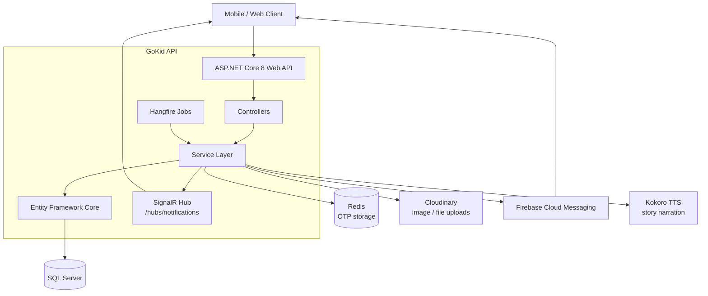
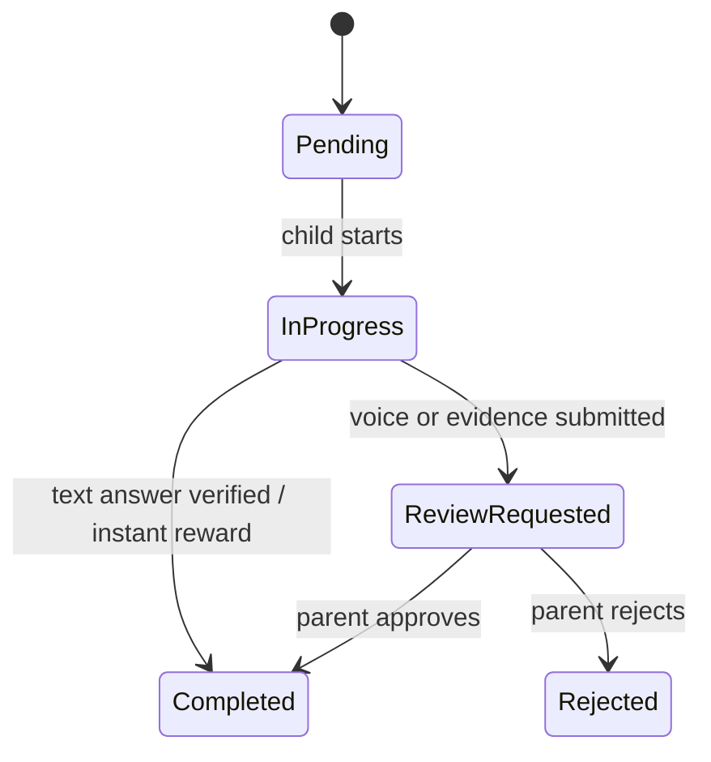
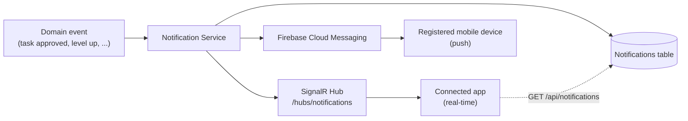

<div align="center">

# GoKid API

**A gamified task and adventure platform that lets parents and educational institutions turn children's daily learning into points, levels, and rewards.**


</div>

---

## Table of Contents

1. [Overview](#1-overview)
2. [Key Features](#2-key-features)
3. [User Roles](#3-user-roles)
4. [System Architecture](#4-system-architecture)
5. [Project Structure](#5-project-structure)
6. [Technology Stack](#6-technology-stack)
7. [Core Domain Workflows](#7-core-domain-workflows)
8. [Level Progression System](#8-level-progression-system)
9. [Notification Architecture](#9-notification-architecture)
10. [Background Jobs](#10-background-jobs)
11. [Data Model](#11-data-model)
12. [Authentication & Authorization](#12-authentication--authorization)
13. [Getting Started](#13-getting-started)
14. [Environment Configuration](#14-environment-configuration)
15. [API Documentation](#15-api-documentation)
16. [API Response Examples](#16-api-response-examples)
17. [Business Rules](#17-business-rules)
18. [Security](#18-security)
19. [Development Notes](#19-development-notes)
20. [Changelog](#20-changelog)
21. [License](#21-license)
22. [Project Information](#22-project-information)

---

## 1. Overview

GoKid is a backend platform that gamifies children's daily tasks and multi-day learning adventures. Children complete tasks, earn points, level up, and redeem gifts, while parents and institution supervisors review their work and follow their progress.

The API serves two environments:

| Environment | Description |
|---|---|
| **Home** | Parents assign tasks from a template library, create milestone rewards, and review their child's submissions. |
| **Institution** | Institution admins manage classes and supervisors and design weekly adventures. Supervisors review adventure submissions, and children compete on leaderboards. |

Additional documents in this repository: [`ROLE_ACTIONS.md`](ROLE_ACTIONS.md), [`FLUTTER_NOTIFICATION_GUIDE.md`](FLUTTER_NOTIFICATION_GUIDE.md), and the [`Docs/`](Docs) folder.

---

## 2. Key Features

### Authentication & Authorization
- ASP.NET Identity with JWT access tokens and refresh tokens
- Email OTP verification and password reset via OTP
- Role-based access control across five roles
- Child login with a 6-digit registration code (no password)

### Social Login
- Google Sign-In via a Google ID token (`POST /api/auth/google`); a Parent account is created automatically on first login

### Task Management
- Four task types: **Instant Reward**, **Text Question** (auto-verified), **Voice Question**, **Evidence Submission** (photo/video)
- Difficulty levels (Easy, Medium, Hard) with corresponding base points
- Daily auto-assignment of 5 random tasks per child
- Parents can assign any task template to their child manually
- Text answers are verified automatically; voice and evidence submissions require review

### Adventure System
- Multi-day gamified quests (typically 7 days) with intro/outro stories
- Text-to-speech story narration (Kokoro TTS)
- Tasks unlock day by day; missed days reduce the star rating
- Stars per task and a 50-point bonus for completing an adventure
- Institution admins assign adventures to whole classes; supervisors approve or reject submissions

### Gamification
- Points with a full transaction audit trail
- Global leaderboard (top 20) and institution leaderboard (top 3)
- Collectible badges, characters, and stars

### Levels & Progression
- 15 seeded levels from *Starter* (0 pts) to *GoKid Legend* (22,000 pts)
- Automatic level-up whenever a child earns enough points; levels never decrease
- Level-up notifications to the child, the parent, and class supervisors
- PlatformAdmin CRUD for level definitions, including badge upload

### Rewards & Gift Store
- Parents create milestone rewards (for example, "reach 500 points → movie night") and mark them as given
- Platform gifts (badges, characters, collectibles) purchasable with points

### Institutions & Classes
- Multi-tenant model: each institution owns its classes, supervisors, and children
- Child enrollment through the child's registration code
- Supervisors can manage multiple classes
- Institution details include a classes summary

### Notifications
- Persistent notifications stored in the database
- Firebase Cloud Messaging push notifications
- Real-time delivery over SignalR

### Dashboards & Statistics
- Role-specific dashboards for InstitutionAdmin, Supervisor, and PlatformAdmin, with in-memory caching
- Child statistics for this week, this month, and all time

---

## 3. User Roles

| Role | Environment | Responsibilities |
|---|---|---|
| **Child** | Home / Institution | Completes tasks and adventures, earns points, levels up, buys gifts, views rankings |
| **Parent** | Home | Creates and assigns tasks, sets rewards, reviews child submissions |
| **InstitutionAdmin** | Institution | Manages classes, supervisors, and adventures; enrolls children |
| **Supervisor** | Institution | Reviews adventure task submissions and tracks class progress |
| **PlatformAdmin** | Platform | Manages task templates, categories, gifts, levels, and institutions |

---

## 4. System Architecture

The API follows a layered architecture: controllers handle HTTP concerns, services contain business logic, and Entity Framework Core provides data access to SQL Server. Recurring work runs in Hangfire jobs that call the same service layer.



---

## 5. Project Structure

```
GoKidAPI/
├── GoKidAPI.sln
├── ROLE_ACTIONS.md
├── FLUTTER_NOTIFICATION_GUIDE.md
├── Docs/                       # Project documentation
└── GoKidAPI/
    ├── Controllers/            # HTTP layer (22 controllers)
    ├── Services/               # Business logic (one folder per domain)
    ├── Entity/                 # EF Core domain models
    │   ├── Account/            #   Identity users, parents, children, supervisors, tokens
    │   ├── Tasks/              #   Task templates, child tasks, categories
    │   ├── Institiution/       #   Institutions, adventures, weekly adventures, progress
    │   ├── Classes/            #   Classes and class supervisors
    │   ├── Gifts/              #   Gifts, child gifts, rewards
    │   ├── Levels/             #   Level entity
    │   └── Base/               #   AuditableEntity
    ├── DTO/                    # Request and response models
    ├── Enums/                  # Status and type enumerations
    ├── Data/                   # AppDbContext
    ├── Migrations/             # EF Core migrations
    ├── Jobs/                   # Hangfire background jobs
    ├── Hubs/                   # SignalR notification hub
    ├── Seeder/                 # Roles, admin user, categories, levels
    ├── Validators/             # FluentValidation rule sets
    ├── Shared/                 # Response<T>, ResponseHandler, PaginatedList<T>, filters
    ├── Extensions/             # Service registration (DI, Hangfire, Swagger)
    ├── Helpers/                # Utility helpers
    └── Program.cs              # Application entry point
```

Notable services: `Auth`, `Points`, `LevelProgression`, `Levels`, `Notifications`, `Firebase`, `Adventure`, `StoryGeneration`, `TTSService`, `Dashboard`, `Ranking`, `Statistics`, `Rewards`, `Gifts`, `Classes`, `Institution`, `Supervisor`.

---

## 6. Technology Stack

| Layer | Technology | Purpose |
|---|---|---|
| Framework | ASP.NET Core 8 Web API | HTTP API |
| Database | SQL Server + Entity Framework Core 8 | Persistence and migrations |
| Authentication | ASP.NET Identity + JWT Bearer | Identity, tokens, roles |
| Real-time | SignalR | In-app notification delivery |
| Background jobs | Hangfire | Scheduled task and adventure processing |
| Data store | Redis | OTP storage |
| File storage | Cloudinary | Image and media uploads |
| Push notifications | Firebase Cloud Messaging | Mobile push notifications |
| Text-to-speech | Kokoro TTS | Adventure story narration |
| Logging | Serilog | Console and rolling file logs |
| Validation | FluentValidation | Request validation |
| Mapping | AutoMapper | DTO ↔ entity mapping |
| API docs | Swagger / OpenAPI | Interactive documentation |

---

## 7. Core Domain Workflows

### Task lifecycle

Tasks come from a template library managed by PlatformAdmins. A `ChildTask` is created either by the daily job or by a parent.



### Adventure lifecycle

1. An InstitutionAdmin creates an adventure (optionally generating the story and voice narration) and assigns it to a class, which creates weekly adventures for the children.
2. Each day, `AdventureAssignmentJob` unlocks the next day's tasks and marks unfinished tasks as missed.
3. Children submit adventure tasks; evidence tasks go to the class supervisor for review.
4. Completing the adventure awards a 50-point bonus.

Adventure task status flow: `Locked → Pending → Completed / Missed`.

### Points lifecycle

Every change to a child's points is recorded as a `PointsTransaction` with its source (task, adventure, or gift purchase). Points are awarded through `PointsService.AwardPointsAsync`, which saves the transaction and then triggers the level check. Gift purchases spend points.

### Reward and gift purchase

- **Gifts** — a child lists affordable gifts (`GET /api/gifts/available`) and purchases one with points; the parent is notified (`GiftPurchased`). Purchased gifts are visible to the child and, for the parent, through `GET /api/gifts/my-child-gifts`.
- **Rewards** — a parent creates a milestone reward, later marks it as given (`PUT /api/rewards/{rewardId}/give`), and the child is notified (`RewardGiven`).

### Notification flow

See [Notification Architecture](#9-notification-architecture).

---

## 8. Level Progression System

`ILevelProgressionService` / `LevelProgressionService` centralizes level upgrades. It compares the child's `TotalPoints` against all active levels and assigns the highest qualifying level.

- **15 levels**, seeded automatically on startup
- **Automatic progression** whenever points are earned
- **No downgrades** — a child never loses an achieved level
- **Level-up notifications** (`NotificationType.LevelUp`) go to the child, the parent, and all supervisors of the child's class (if the child is enrolled in an institution)

| Order | Name | Min Points |
|---:|---|---:|
| 1 | Starter | 0 |
| 2 | Explorer | 100 |
| 3 | Adventurer | 250 |
| 4 | Trailblazer | 500 |
| 5 | Guardian | 800 |
| 6 | Hero | 1,200 |
| 7 | Champion | 1,800 |
| 8 | Legend | 2,500 |
| 9 | Master | 3,500 |
| 10 | Grand Master | 5,000 |
| 11 | Superstar | 7,000 |
| 12 | Elite | 9,500 |
| 13 | Ultimate Hero | 13,000 |
| 14 | Mythic | 17,000 |
| 15 | GoKid Legend | 22,000 |

### Level checks

Points are awarded through three paths; all of them trigger a level check.

| Path | Trigger |
|---|---|
| Child completes an `InstantReward` or `VoiceQuestion` adventure task | `PointsService.AwardPointsAsync` performs the level check internally |
| Supervisor approves an `EvidenceSubmission` adventure task | `SupervisorService.ReviewChildTaskAsync` performs an explicit level check |
| Parent approves a child task | `ParentTaskService.ReviewChildTaskAsync` performs an explicit level check |

### `LevelInfo`

Every endpoint that returns child data embeds a `level` object. It is `null` when the child has no level assigned yet.

```json
{
  "level": {
    "id": "string",
    "name": "Guardian",
    "order": 5,
    "badgeUrl": "https://..."
  }
}
```

`LevelInfo` is included in: class children lists, child adventure history, institution child lists, adventure task review responses, ranking items, parent statistics, and child/parent task detail responses.

---

## 9. Notification Architecture

Every notification is persisted first, then delivered through two channels.



- **Persistent** — stored with an `IsRead` flag and retrievable through `GET /api/notifications`.
- **Push** — clients register an FCM token through `POST /api/notifications/device-token`.
- **Real-time** — SignalR hub at `/hubs/notifications`.

See [`FLUTTER_NOTIFICATION_GUIDE.md`](FLUTTER_NOTIFICATION_GUIDE.md) for client integration.

### Notification types

| Type | Value | Recipient |
|---|---:|---|
| `TaskAssigned` | 0 | Child |
| `TaskStarted` | 1 | Child |
| `ReviewRequested` | 2 | Parent |
| `TaskApproved` | 3 | Child |
| `TaskRejected` | 4 | Child |
| `PointsEarned` | 5 | Child |
| `AdventureStarted` | 6 | Child |
| `WeekBonus` | 7 | Child |
| `ChildLinked` | 8 | Parent |
| `GiftPurchased` | 9 | Parent |
| `RewardGiven` | 10 | Child |
| `AdventureNewDay` | 11 | Child |
| `SupervisorAssignedToClass` | 12 | Supervisor |
| `SupervisorUnassignedFromClass` | 13 | Supervisor |
| `ChildEnrolledToClass` | 14 | Supervisor |
| `ChildRemovedFromClass` | 15 | Supervisor |
| `WeeklyAdventureStarted` | 16 | Child |
| `DailyAdventureTasksAssigned` | 17 | Supervisor |
| `AdventureDayCompleted` | 18 | Supervisor |
| `LevelUp` | 19 | Child, Parent, and class Supervisors |

---

## 10. Background Jobs

Recurring jobs are registered at startup in `Program.cs` and run through Hangfire. The dashboard is available at `/hangfire`.

| Job | Schedule | Description |
|---|---|---|
| `DailyTaskAssignmentJob` | Daily, 00:00 UTC | Assigns 5 random tasks to each child, avoiding duplicates |
| `AdventureAssignmentJob` | Daily, 00:00 UTC | Unlocks the next adventure day, marks missed tasks, and handles completion bonuses |

The repository also contains `AdventureTtsJob` and `StoryTtsJob` for text-to-speech generation of adventure stories.

---

## 11. Data Model

Key entities and relationships:

```mermaid
erDiagram
    AppUser ||--o| Parent : "shares Id"
    AppUser ||--o| Child : "shares Id"
    AppUser ||--o| InstitutionAdmin : "shares Id"
    Parent ||--o{ Child : "has"
    Level ||--o{ Child : "current level"
    Child ||--o{ ChildTask : "assigned"
    TaskTemplate ||--o{ ChildTask : "instantiated as"
    Child ||--o{ PointsTransaction : "earns / spends"
    Child ||--o{ ChildGift : "purchases"
    Gift ||--o{ ChildGift : "purchased as"
    Institution ||--o{ Class : "contains"
    Institution ||--o{ Supervisor : "employs"
    Institution ||--o{ Child : "enrolls"
    InstitutionAdmin ||--o| Institution : "managed by"
    Class ||--o{ ClassSupervisor : "supervised by"
    Adventure ||--o{ WeeklyAdventure : "assigned as"
    Class ||--o{ WeeklyAdventure : "receives"
    WeeklyAdventure ||--o{ ChildAdventureTask : "generates"
    Child ||--o{ ChildAdventureTask : "completes"
```

Highlights:

- `Child.Id`, `Parent.Id`, and `InstitutionAdmin.Id` equal the corresponding `AppUser.Id` (shared primary key), so JWT claims always match the profile record.
- A **Child** has a 6-digit `RegistrationCode` and a `LevelId` foreign key updated by `LevelProgressionService`.
- A **Parent** has one active child at a time (`ActiveChildId`).
- `PointsTransaction` records every point change with its source type.
- `Level` is soft-deletable; deletion is blocked while children are assigned to it.
- Status flows: `ChildTask`: `Pending → InProgress → ReviewRequested → Completed / Rejected`; `ChildAdventureTask`: `Locked → Pending → Completed / Missed`.

---

## 12. Authentication & Authorization

| Mechanism | Details |
|---|---|
| **Identity** | ASP.NET Identity manages users, roles, and password hashing |
| **JWT** | Bearer access tokens issued at login; validated on every protected endpoint |
| **Refresh tokens** | Issued with the access token; exchanged via `POST /api/account/refresh-token` and invalidated on logout |
| **Roles** | `PlatformAdmin`, `InstitutionAdmin`, `Supervisor`, `Parent`, `Child` — enforced with `[Authorize(Roles = ...)]` |
| **Email OTP** | Parent registration is verified with an OTP; password reset also uses an OTP |
| **Google login** | `POST /api/auth/google` accepts a Google ID token; creates a Parent on first login |
| **Child registration code** | Each child has a 6-digit code used for login (no password) and for institution enrollment |

Send the access token in the `Authorization: Bearer <token>` header.

---

## 13. Getting Started

### Prerequisites

- [.NET 8 SDK](https://dotnet.microsoft.com/download/dotnet/8.0)
- SQL Server
- Redis
- Cloudinary account
- SMTP server (email and OTP)
- Firebase project (push notifications)
- EF Core CLI: `dotnet tool install --global dotnet-ef`

### Setup

```bash
# 1. Clone
git clone https://github.com/graducationProject-goKid/gokid-api.git
cd gokid-api/GoKidAPI

# 2. Configure (see "Environment Configuration")
cp appsettings.example.json appsettings.json
#    edit appsettings.json and place your Firebase service-account JSON in this folder

# 3. Apply database migrations
dotnet ef database update

# 4. Run the API
dotnet run
```

| Resource | URL |
|---|---|
| Swagger UI | `https://localhost:{port}/swagger` |
| Hangfire dashboard | `https://localhost:{port}/hangfire` |
| SignalR hub | `https://localhost:{port}/hubs/notifications` |

### First-run seeding

On first run the seeders create the default roles (PlatformAdmin, Parent, Child, InstitutionAdmin, Supervisor), the default platform admin user, the default task categories, and all 15 child levels. Optional demo data is controlled by `Seeding:EnableDemoData` (default `false`).

---

## 14. Environment Configuration

Copy `GoKidAPI/appsettings.example.json` to `GoKidAPI/appsettings.json` and replace every placeholder. `appsettings.json`, `appsettings.Development.json`, and the Firebase key are git-ignored.

```json
{
  "ConnectionMode": "Default",
  "ConnectionStrings": {
    "Redis": "localhost:6379",
    "Default": "Server=YOUR_SERVER; Database=YOUR_DB; User Id=YOUR_USER; Password=YOUR_PASSWORD; Encrypt=True; TrustServerCertificate=True; MultipleActiveResultSets=True;"
  },
  "JWT": {
    "Secret": "YOUR_LONG_RANDOM_SECRET",
    "ValidIssuer": "https://localhost:7204",
    "ValidAudience": "https://localhost:7204"
  },
  "Cloudinary": {
    "CloudName": "YOUR_CLOUDNAME",
    "ApiKey": "YOUR_APIKEY",
    "ApiSecret": "YOUR_APISECRET"
  },
  "EmailSettings": {
    "FromEmail": "YOUR_FROMEMAIL",
    "FromName": "GO-KID",
    "SmtpServer": "smtp.example.com",
    "SmtpPort": 587,
    "Username": "YOUR_USERNAME",
    "Password": "YOUR_PASSWORD",
    "EnableSsl": true
  },
  "Firebase": {
    "CredentialFilePath": "your-firebase-adminsdk.json"
  },
  "Authorization": {
    "Google": {
      "ClientId": "YOUR_CLIENTID",
      "clientSecret": "YOUR_CLIENTSECRET"
    }
  },
  "Seeding": { "EnableDemoData": false }
}
```

| Section | Notes |
|---|---|
| `ConnectionMode` | Selects which entry of `ConnectionStrings` is used (`Live`, `Test`, or `Default`) |
| `ConnectionStrings` | SQL Server connection strings and the Redis endpoint |
| `JWT` | Use a long, random secret; issuer and audience must match your deployment |
| `Cloudinary` | Credentials for image and file uploads |
| `EmailSettings` | SMTP settings used for OTP and password-reset emails |
| `Firebase` | Path to the service-account JSON downloaded from the Firebase console |
| `Authorization:Google` | OAuth client used to validate Google ID tokens |

### Security best practices

- **Never commit secrets.** Keep real values out of source control.
- For local development use [`dotnet user-secrets`](https://learn.microsoft.com/aspnet/core/security/app-secrets):
  ```bash
  dotnet user-secrets init
  dotnet user-secrets set "JWT:Secret" "<value>"
  ```
- In production, supply configuration through **environment variables** (for example `JWT__Secret`, `ConnectionStrings__Default`) or a secret manager.
- Keep the Firebase service-account file out of the repository and mount it at deploy time.
- Rotate any credential that has ever been exposed.

> **Security note:** Credentials were committed to this repository earlier in its history. The history has since been rewritten to remove them, and all affected credentials were rotated. Clones made before the rewrite may still contain the old history and should be discarded.

---

## 15. API Documentation

All responses use the `Response<T>` wrapper. Interactive documentation is available in Swagger at `/swagger`. Authentication values: `Public`, `Authenticated` (any signed-in user), or a specific role.

### Authentication — `/api/account`

| Method | Endpoint | Description | Authentication |
|---|---|---|---|
| POST | `/register` | Parent registration | Public |
| POST | `/verify-otp` | Email OTP verification | Public |
| POST | `/resend-otp` | Resend OTP | Public |
| POST | `/login` | Login (all roles) | Public |
| POST | `/refresh-token` | Refresh JWT | Public |
| POST | `/logout` | Invalidate tokens | Authenticated |
| POST | `/forgot-password` | Request password reset OTP | Public |
| POST | `/reset-password` | Reset password with OTP | Public |
| POST | `/change-password` | Change password | Authenticated |
| GET | `/profile` | Get profile (parent or child) | Authenticated |

### Social Login — `/api/auth`

| Method | Endpoint | Description | Authentication |
|---|---|---|---|
| POST | `/google` | Sign in with a Google ID token; creates a Parent account on first login and issues JWT + refresh tokens | Public |

### Child — `/api/child`

| Method | Endpoint | Description | Authentication |
|---|---|---|---|
| GET | `/` | Get the child's task list | Child |
| GET | `/points` | Get current point balance | Child |
| POST | `/submit/{taskId}` | Submit task answer / evidence | Child |

### Parent — `/api/account` and `/api/parent-task`

| Method | Endpoint | Description | Authentication |
|---|---|---|---|
| POST | `/api/account/child` | Create a child account | Parent |
| POST | `/api/parent-task/assign` | Assign a task to a child | Parent |
| GET | `/api/parent-task` | List assigned tasks | Parent |
| GET | `/api/parent-task/{childTaskId}/details` | Task details (child view) | Parent |
| GET | `/api/parent-task/{childTaskId}/review` | Task review details (parent view) | Parent |
| POST | `/api/parent-task/review` | Approve or reject a task | Parent |

### Tasks — `/api/task-templates`

| Method | Endpoint | Description | Authentication |
|---|---|---|---|
| POST | `/instant-reward` | Create instant reward task | PlatformAdmin |
| POST | `/text-question` | Create text question task | PlatformAdmin |
| POST | `/voice-question` | Create voice question task | PlatformAdmin |
| POST | `/evidence-submission` | Create evidence task | PlatformAdmin |
| GET | `/` | List templates (paginated, filterable) | Authenticated |
| GET | `/{id}` | Get template by ID | Authenticated |
| GET | `/subcategory/{subCategoryId}` | Filter by subcategory | Authenticated |
| GET | `/category/{categoryId}` | Filter by category | Authenticated |

### Adventures — `/api/adventure` and `/api/child-adventure`

| Method | Endpoint | Description | Authentication |
|---|---|---|---|
| POST | `/api/adventure` | Create adventure | InstitutionAdmin |
| GET | `/api/adventure` | List adventures (paginated) | Authenticated |
| GET | `/api/adventure/{adventureId}` | Adventure details | Authenticated |
| PUT | `/api/adventure/{adventureId}` | Update adventure | InstitutionAdmin |
| DELETE | `/api/adventure/{adventureId}` | Soft delete adventure | InstitutionAdmin |
| PATCH | `/api/adventure/{adventureId}/status` | Toggle Active / Inactive | InstitutionAdmin |
| POST | `/api/adventure/classes/{classId}/assign-adventure` | Assign adventure to a class | InstitutionAdmin |
| POST | `/api/adventure/{adventureId}/generate-story` | AI-generate story | InstitutionAdmin |
| GET | `/api/adventure/{adventureId}/story` | Get story with voice | Authenticated |
| GET | `/api/child-adventure` | My weekly adventures | Child |
| GET | `/api/child-adventure/{weeklyAdventureId}` | Adventure details | Child |
| GET | `/api/child-adventure/weekly-adventures/{weeklyAdventureId}/tasks` | Day tasks with lock status | Child |
| POST | `/api/child-adventure/adventure-tasks/submit` | Submit an adventure task | Child |

### Supervisor — `/api/supervisor` and `/api/institutionsupervisor`

| Method | Endpoint | Description | Authentication |
|---|---|---|---|
| GET | `/api/supervisor/adventures` | My assigned adventures | Supervisor |
| GET | `/api/supervisor/adventures/{weeklyAdventureId}/tasks` | Tasks pending review (with child level) | Supervisor |
| PUT | `/api/supervisor/tasks/{childAdventureTaskId}/review` | Approve or reject (triggers level check) | Supervisor |
| GET | `/api/supervisor/adventures/{weeklyAdventureId}/classes/{classId}/children` | Class progress (with child level) | Supervisor |
| GET | `/api/supervisor/adventures/{weeklyAdventureId}/children/{childId}/history` | Child history (with child level) | Supervisor |
| GET | `/api/supervisor/classes` | My supervised classes | Supervisor |
| GET | `/api/institutionsupervisor/supervisors` | Paginated, searchable supervisor list (scoped to the admin's institution) | See note |
| POST | `/api/institutionsupervisor` | Create a supervisor | See note |
| PUT | `/api/institutionsupervisor/{supervisorId}` | Update a supervisor | See note |
| DELETE | `/api/institutionsupervisor/{supervisorId}` | Delete a supervisor | See note |

> **TODO:** The `[Authorize(Roles = "InstitutionAdmin,PlatformAdmin")]` attribute on `GET /api/institutionsupervisor/supervisors` is currently commented out in the controller. Confirm and enforce the intended access policy for the institution-supervisor endpoints.

### Rankings — `/api/ranking`

| Method | Endpoint | Description | Authentication |
|---|---|---|---|
| GET | `/global` | Global leaderboard, top 20; each item includes `level` | Authenticated |
| GET | `/institution` | Institution leaderboard, top 3; each item includes `level` | Authenticated |

### Statistics — `/api/statistics`

| Method | Endpoint | Description | Authentication |
|---|---|---|---|
| GET | `/` | Stats for ThisWeek / ThisMonth / AllTime, plus child `level` | Authenticated |

### Levels — `/api/levels`

| Method | Endpoint | Description | Authentication |
|---|---|---|---|
| GET | `/` | List all levels (ordered) | PlatformAdmin |
| GET | `/{levelId}` | Get level by ID | PlatformAdmin |
| POST | `/` | Create a level (optional badge image) | PlatformAdmin |
| PUT | `/{levelId}` | Update a level (patch-style, optional badge upload) | PlatformAdmin |
| DELETE | `/{levelId}` | Soft delete (blocked if children are assigned) | PlatformAdmin |

### Notifications — `/api/notifications`

| Method | Endpoint | Description | Authentication |
|---|---|---|---|
| GET | `/` | My notifications (paginated) | Authenticated |
| PUT | `/{notificationId}/read` | Mark as read | Authenticated |
| PUT | `/read-all` | Mark all as read | Authenticated |
| DELETE | `/{notificationId}` | Delete a notification | Authenticated |
| POST | `/device-token` | Register FCM device token | Authenticated |

### Rewards — `/api/rewards`

| Method | Endpoint | Description | Authentication |
|---|---|---|---|
| POST | `/` | Create reward milestone | Parent |
| GET | `/` | Parent's rewards | Parent |
| DELETE | `/{rewardId}` | Delete reward | Parent |
| PUT | `/{rewardId}/give` | Mark reward as given | Parent |
| GET | `/my-rewards` | Child's received rewards | Child |

### Gifts — `/api/gifts`

| Method | Endpoint | Description | Authentication |
|---|---|---|---|
| POST | `/` | Create gift | PlatformAdmin |
| GET | `/` | All gifts | PlatformAdmin |
| PUT | `/{giftId}` | Update gift | PlatformAdmin |
| DELETE | `/{giftId}` | Delete gift | PlatformAdmin |
| PATCH | `/{giftId}/status` | Toggle status | PlatformAdmin |
| GET | `/available` | Available (affordable) gifts | Child |
| POST | `/{giftId}/purchase` | Purchase with points | Child |
| GET | `/my-gifts` | My purchased gifts | Child |
| GET | `/my-child-gifts` | Parent views child's gifts | Parent |

### Classes — `/api/class`

| Method | Endpoint | Description | Authentication |
|---|---|---|---|
| POST | `/` | Create class | InstitutionAdmin |
| GET | `/` | List classes (paginated) | Authenticated |
| GET | `/{classId}` | Class details | Authenticated |
| PUT | `/{classId}` | Update class | InstitutionAdmin |
| DELETE | `/{classId}` | Delete class | InstitutionAdmin |
| POST | `/assign-supervisor/{classId}` | Assign supervisor | InstitutionAdmin |
| DELETE | `/{classId}/supervisors/{supervisorId}` | Remove supervisor | InstitutionAdmin |
| POST | `/institution/enroll-child` | Enroll child by registration code | InstitutionAdmin |
| DELETE | `/institution/children/{childId}` | Remove child from institution | InstitutionAdmin |
| POST | `/{classId}/enroll-child` | Assign child to class | InstitutionAdmin |
| DELETE | `/{classId}/children/{childId}` | Remove child from class | InstitutionAdmin |
| GET | `/institution/children` | Institution children with level (paginated) | InstitutionAdmin |

### Institutions — `/api/institutions`

| Method | Endpoint | Description | Authentication |
|---|---|---|---|
| POST | `/` | Create institution and admin account | PlatformAdmin |
| GET | `/` | List institutions | PlatformAdmin |
| GET | `/{institutionId}` | Institution details (includes classes summary) | Authenticated |
| PUT | `/{institutionId}` | Update institution | InstitutionAdmin |
| DELETE | `/{institutionId}` | Delete institution | PlatformAdmin |
| PATCH | `/{institutionId}/logo` | Upload institution logo | InstitutionAdmin |

### Dashboards

Aggregate statistics per role, cached in memory. Each dashboard has a `DELETE` endpoint to clear its cache.

| Method | Endpoint | Description | Authentication |
|---|---|---|---|
| GET | `/api/institution/dashboard` | Institution dashboard (cached 5 min per institution) | InstitutionAdmin |
| DELETE | `/api/institution/dashboard/cache` | Clear institution dashboard cache | InstitutionAdmin |
| GET | `/api/supervisor/dashboard` | Supervisor dashboard (cached 3 min per supervisor) | Supervisor |
| DELETE | `/api/supervisor/dashboard/cache` | Clear supervisor dashboard cache | Supervisor |
| GET | `/api/platform/dashboard` | Platform dashboard | PlatformAdmin |
| DELETE | `/api/platform/dashboard/cache` | Clear platform dashboard cache | PlatformAdmin |

### Categories — `/api/category` and `/api/task-sub-category`

Standard CRUD for task categories and subcategories: PlatformAdmin for writes, Authenticated for reads.

---

## 16. API Response Examples

Examples below reflect the response models in the code; values are illustrative. Field names are shown in camelCase.

### Login

`POST /api/account/login`

```json
{
  "accessToken": "<jwt>",
  "refreshToken": "<refresh-token>",
  "userId": "string",
  "displayName": "string",
  "email": "string",
  "userType": "string",
  "profileImageUrl": "https://...",
  "childId": null,
  "parentId": null
}
```

`childId` and `parentId` are populated for child accounts. The payload is wrapped in `Response<T>`.

### LevelInfo

```json
{
  "id": "string",
  "name": "Guardian",
  "order": 5,
  "badgeUrl": "https://..."
}
```

### Ranking item

`GET /api/ranking/global`

```json
{
  "rank": 1,
  "childId": "string",
  "childName": "string",
  "avatarUrl": "https://...",
  "highestPoints": 1250,
  "isCurrentChild": false,
  "level": { "id": "string", "name": "Hero", "order": 6, "badgeUrl": "https://..." }
}
```

### Notification

`GET /api/notifications`

```json
{
  "id": "string",
  "type": 19,
  "title": "string",
  "body": "string",
  "relatedEntityId": "string",
  "isRead": false,
  "createdAt": "2026-01-01T00:00:00Z"
}
```

`type` is the numeric `NotificationType` (see [Notification types](#notification-types)).

### Task submission

`POST /api/child/submit/{taskId}` accepts a `SubmitTaskRequest`, which contains the `ChildTask` ID (`taskId`, required — not the task template ID). Additional fields depend on the task type (for example, an audio file for `VoiceQuestion`); see Swagger for the exact schema.

---

## 17. Business Rules

- **Levels never downgrade.** A child's level can only increase.
- **Soft deletion.** Entities are flagged with `IsDeleted` and filtered out by global query filters; no data is permanently lost.
- **Level deletion is restricted.** A level cannot be deleted while any child is assigned to it.
- **Child registration code.** Each child has a unique 6-digit code used for login and for institution enrollment.
- **Points audit trail.** Every point change creates a `PointsTransaction` with its source type.
- **Adventure progression.** Tasks unlock day by day; unfinished tasks from past days are marked `Missed` and reduce the star rating; completing the adventure grants 50 bonus points.
- **Review requirements.** Text questions are auto-verified. Voice questions and evidence submissions require review by the parent (home tasks) or the supervisor (adventure tasks).
- **Daily assignment.** Each child receives 5 random tasks per day, without duplicates.
- **One active child per parent.** A parent works with a single active child at a time (`ActiveChildId`).
- **Shared identity key.** `Child`, `Parent`, and `InstitutionAdmin` share their primary key with `AppUser`.

---

## 18. Security

Security features explicitly supported by the project:

- ASP.NET Identity user management and password hashing
- JWT bearer authentication with refresh tokens and logout invalidation
- Role-based authorization on controllers and actions
- Email OTP verification and OTP-based password reset
- Google ID token validation for social login
- Child login through a registration code instead of a password
- Request validation with FluentValidation
- Soft deletion and auditing (`CreatedAt`, `UpdatedAt`, `CreatedBy`, `UpdatedBy`)
- Secrets excluded from source control (git-ignored configuration and Firebase key; see [Environment Configuration](#14-environment-configuration))

---

## 19. Development Notes

- **EF Core migrations** live in `GoKidAPI/Migrations`. Apply them with `dotnet ef database update`; add new ones with `dotnet ef migrations add <Name>`.
- **Seeders** (`Seeder/`) create roles, the default platform admin, task categories, and the 15 levels on startup.
- **Soft delete** uses an `IsDeleted` flag with global query filters.
- **Auditing** is provided by `AuditableEntity` (`CreatedAt`, `UpdatedAt`, `CreatedBy`, `UpdatedBy`).
- **AutoMapper** maps between entities and DTOs.
- **FluentValidation** rule sets are in `Validators/`.
- **`Response<T>`** and `ResponseHandler` provide a consistent response envelope (`succeeded`, `message`, `statusCode`, `data`) across all endpoints.
- **`PaginatedList<T>`** is the standard shape for paginated results.
- **Service layer** sits between controllers and data access; controllers contain no business logic.
- **Logging** uses Serilog (console and rolling files under `Logs/`).

---

## 20. Changelog

### Latest updates

**Dashboards & social login**
- Added statistics dashboards for InstitutionAdmin, Supervisor, and PlatformAdmin with in-memory caching and cache-clearing endpoints
- Added Google Sign-In (`POST /api/auth/google`)
- Added more notification scenarios for supervisors and children

**Children levels**
- Added the `Level` entity and 15 seeded levels (Starter → GoKid Legend)
- Added PlatformAdmin CRUD at `/api/levels` with Cloudinary badge upload
- Added `Child.LevelId` (restricted delete behavior) and the lightweight `LevelInfo` DTO embedded in all child-related responses
- Added `LevelProgressionService`: automatic upgrades, no downgrades, and `LevelUp` notifications to child, parent, and class supervisors
- `PointsService.AwardPointsAsync` now saves internally and triggers the level check

**Institution admin identity**
- `InstitutionAdmin.Id` now equals `AppUser.Id` (shared primary key, same as `Parent` and `Child`), removing the mismatch between JWT claims and database lookups
- Institution details now include a `classes` summary (`id`, `name`, `childrenCount`, `supervisorsCount`, `createdAt`)

**Notifications and profiles**
- Notifications are persisted with an `IsRead` flag and exposed through `/api/notifications`; device-token registration added for Firebase push
- `GET /api/account/profile` returns the authenticated user's profile; the parent profile includes the active child with level, and the child profile includes level, class, institution, and registration code

**Repository hygiene**
- Removed committed secrets from the repository history, added `appsettings.example.json`, and expanded `.gitignore`

---

## 21. License

TODO: No license has been specified for this project. Add a `LICENSE` file and update this section.

---

## 22. Project Information

GoKid is a **graduation project** implementing the backend for a gamified learning and task-management platform for children, parents, and educational institutions.

- **Repository:** <https://github.com/graducationProject-goKid/gokid-api>
- **Authors / team:** TODO
- **University / supervisor:** TODO
